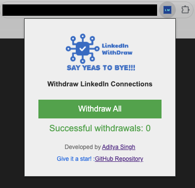

# Auto Withdraw Connections Chrome Extension


## Overview

**Auto Withdraw Connections** is a Chrome extension designed to automatically withdraw all pending connection requests on a specified webpage. This tool is especially useful for users who have accumulated many pending requests and want to quickly and efficiently manage them.

## Features

- Automatically withdraws all pending connection requests with a single click.
- Displays the number of successful withdrawals.
- Provides a user-friendly interface with a progress indicator.
- Open source and ready for contributions.

## Installation (If Not Found on Chrome Web Store or for Custom Modifications)

### Prerequisites

- **Google Chrome**: Make sure you have the latest version of Google Chrome installed.

### Steps

1. **Clone or download this repository**.
   ```sh
   git clone https://github.com/yourusername/your-repo.git
   ```
2. Open Chrome and go to `chrome://extensions/`.
3. Enable "Developer mode" by clicking the toggle switch in the top right corner.
4. Click the "Load unpacked" button and select the directory where you cloned the repository.

## Screenshots



## Usage

1. Navigate to the webpage with the connection requests you want to withdraw.
2. Click on the extension icon in the Chrome toolbar.
3. In the popup that appears, click the "Withdraw All" button.
4. The extension will start withdrawing all pending connection requests and display the number of successful withdrawals.

## Contributing

We welcome contributions from the community! If you have ideas for improvements or have identified bugs, please feel free to fork this repository and submit a pull request.

### Steps to Contribute

1. Fork the repository.
2. Create a new branch for your feature or bugfix.
   ```sh
   git checkout -b feature-name
   ```
3. Make your changes.
4. Commit your changes.
   ```sh
   git commit -m "Description of the feature or fix"
   ```
5. Push to your branch.
   ```sh
   git push origin feature-name
   ```
6. Open a pull request with a description of your changes.

## Code of Conduct

This project adheres to a Code of Conduct. By participating, you are expected to uphold this code. Please report unacceptable behavior to [mailiconadi@gmail.com](mailto:mailiconadi@gmail.com).

## Roadmap

- **Enhancement**: Add support for other browsers (Firefox, Edge).
- **Feature**: Implement a settings page to customize the withdrawal process.
- **Bug Fix**: Improve error handling and logging.

## Contact

If you have any questions or need further assistance, feel free to reach out to me:

- **Email**: [mailiconadi@gmail.com](mailto:mailiconadi@gmail.com)
- **GitHub**: [Techiesingh](https://github.com/techiesingh)
- **LinkedIn**: [Aditya Singh](https://www.linkedin.com/in/techiesingh)

## License

This project is licensed under the MIT License - see the [LICENSE](LICENSE) file for details.

## Acknowledgements

- Thank you to all contributors who are willing to improve this project.
- Special thanks to the open-source community for providing valuable resources.
